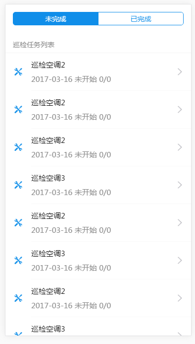

# 设备巡检列表

介绍如何基于React WxEAP开发一个巡检列表，支持下拉刷新，上拉加载和筛选状态，效果如下



<a id="1"/>

## 新建工程
通过SVN拷贝模板工程然后删除目录下的`.svn`文件，修改模板工程的名字，即可新建一个工程

> 地址: http://192.168.0.7:8080/svn/wxapp/trunk/code/MobileTemplate

用`Visual Studio Code`打开工程文件夹，`VSCode`会自动创建`.vscode`文件，以后在资源浏览器中，随意打开一个js文件即可打开整个工程


**安装依赖**

在工程目录下运行命令
> npm install

运行程序
> npm start

接下来就是用`smr(service-model-route)三步法`创建一个视图应用

<a id="2"/>

## 创建service

在`services`文件夹下创建tasksList.js
```js
//services/tasksList.js
import { request } from 'react-wxeap-mobile';
import { PAGE_SIZE } from '../constants';

//export一个叫`fetchList`方法, 返回通过`request`请求到的数据
export function fetchList({ selectedIndex, page }) {
  return request(`${API}csmequip/QueryTasks?page=${page}&pageSize=${PAGE_SIZE}&state=${selectedIndex}`);
} 
```


<a id="3"/>

## 创建model
在`models`文件夹下创建`tasksList.js`

```js
//models/tasksList.js
import { fetchList } from '../services/tasksList';
import { PAGE_SIZE } from '../constants';
export default {
  namespace: 'tasksList',
  state: {
    selectedIndex: 0,//状态选择
    list: [],//列表数据
    isLoading: true,//是否正在进行网络请求
    page: 1,//当前页数
    refreshing: true,//刷新控件是否正在刷新
    allLoaded: false//是否全部加载完毕
  },
  reducers: {
    //保存状态reducer,通常save能满足大部分业务需求
    save(state, { payload }) {
      return { ...state, ...payload }
    },
  },
  effects: {
    //初始化的方法，当路由到此视图、用户强制刷新或者切换任务状态筛选时，会调用此方法
    *initFetch({ payload: { selectedIndex: index } }, { call, put, select }) {
      try {
        //获取当前的state
        const tasksListStates = yield select(state => state.tasksList);
        //过滤传入的selectedIndex
        const selectedIndex = index == undefined ? tasksListStates.selectedIndex : index;
        //初始化state，设置状态为加载中
        yield put({
          type: 'save',
          payload: {
            list: [],
            selectedIndex,
            isLoading: true,
            refreshing: true,
            page: 1,
            allLoaded: false
          }
        })
        //抓取列表数据
        const { data, err } = yield call(fetchList, { selectedIndex, page: 1 });
        //为了防止程序崩溃，如果发生服务器错误，直接返回，底层会自动输出错误信息
        if (err) return;
        //保存列表数据，翻转刷新状态
        yield put({
          type: 'save',
          payload: {
            list: data.tasks,
            isLoading: false,
            refreshing: false
          }
        })
      } catch (err) {
        console.error('taskDetail/initFetch:', err);
      }
    },
    //“加载更多”调用的方法
    *fetch({ payload: { page } }, { call, put, select }) {
      try {
        //设置加载状态，更新当前页数
        yield put({
          type: 'save',
          payload: {
            isLoading: true,
            page
          }
        })
        //获取当前的任务状态和列表数据
        const { selectedIndex, list } = yield select(state => state.tasksList);
        //抓取列表数据
        const { data, err } = yield call(fetchList, { selectedIndex, page });
        if (err) return;
        //拼接上新获取的数据，如果新获取的数据长度小于"PAGE_SIZE"，代表已经全部加载
        yield put({
          type: 'save',
          payload: {
            isLoading: false,
            list: [...list, ...data.tasks],
            allLoaded: data.tasks.length < PAGE_SIZE ? true : false
          }
        })
        console.log('ferchMore, page: ', page)
      }
      catch (err) {
        console.error('taskDetail/fetch:', err);
      }
    },
  },
  subscriptions: {
    //初始化
    setup({ dispatch, history }) {
      return history.listen(({ pathname, query }) => {
        if (pathname === '/') {
          dispatch({ type: 'initFetch', payload: query });
        }
      });
    },
  },
};
```

<a id="4"/>

## 创建route
在`Routes`文件夹下新建一个TasksList.js，路由一般首字母大写
```jsx
import React from 'react';
import { HEIGHT, WIDTH, routerRedux, connect } from 'react-wxeap-mobile';
import { PAGE_SIZE } from '../constants'
import {
  SegmentedControl,
  WingBlank,
  List,
  ListView,
  RefreshControl
} from 'antd-mobile';
const Item = List.Item;
const Brief = Item.Brief;

//创建内联样式
const styles = {
  container: {
    backgroundColor: '#fff'
  },
  wingBlank: {
    paddingTop: 30,
    paddingBottom: 30
  },
  listView: {
    height: HEIGHT * 11 / 12,
    width: WIDTH,
  },
  loading: {
    marginTop: 10,
    width: 40,
    height: 40
  },
  footer: {
    padding: 30,
    textAlign: 'center'
  }
}


class TasksList extends React.Component {

  //初始化
  constructor(props) {
    super(props);
    const dataSource = new ListView.DataSource({
      rowHasChanged: (row1, row2) => row1 !== row2,
    });
    //把列表数据填充到state
    this.state = {
      dataSource: dataSource.cloneWithRows([]),
    }
  }

  //列表数据发生变化，更新state
  componentWillReceiveProps(nextProps) {
    if (nextProps.dataSource !== this.props.dataSource) {
      this.setState({
        dataSource: this.state.dataSource.cloneWithRows(nextProps.dataSource),
      });
    }
  }

  //当列表滑到最低端调用
  onEndReached = () => {
    const { isLoading, allLoaded } = this.props;
    //当正在加载时不响应该方法
    if (!isLoading && !allLoaded) {
      this.props.dispatch({
        type: 'tasksList/fetch', payload: {
          page: this.props.page + 1
        }
      })
    }
  }

  //触发下拉刷新
  onRefresh = () => {
    const { refreshing } = this.props;
    if (!refreshing) {
      this.props.dispatch({
        type: 'tasksList/initFetch',
        payload: {}
      })
    }
  }

  //筛选状态更改
  onIndexChange = e => {
    this.props.dispatch({ type: 'tasksList/initFetch', payload: { selectedIndex: e.nativeEvent.selectedSegmentIndex } })
  }


  //点击了某一列表项
  onItemClick = (rowData) => {
    const { taskId, taskTitle, taskDate, taskEquipNum } = rowData;
    this.props.dispatch(routerRedux.push({
      pathname: '/TaskDetail',
      query: {
        taskId,
        taskTitle
      }
    }))
  }

  //根据数字获取状态名
  getTaskStateString = (taskState) => {
    switch(taskState) {
      case 0: return '未开始'
      case 1: return '进行中'
      case 2: return '已完成'
      default: return ''
    }
  }

  render() {
    const { dispatch, selectedIndex, isLoading, refreshing, allLoaded } = this.props;
    //渲染每一行
    const row = (rowData, sectionID, rowID) =>
      <Item key={rowID} arrow="horizontal" thumb={require('../assets/taskEquip.png')} multipleLine onClick={() => this.onItemClick(rowData)}>
        {rowData.taskTitle} <Brief>{rowData.taskDate+`    `+this.getTaskStateString(rowData.taskState)+`    `+rowData.taskEquipNum}</Brief>
      </Item>

    return (
      <div style={styles.container}>
        <WingBlank size="lg" style={styles.wingBlank}>
          <SegmentedControl values={['未完成', '已完成']} selectedIndex={selectedIndex} onChange={this.onIndexChange} />
        </WingBlank>
        <div>
          <ListView
            ref="lv"
            style={styles.listView}
            dataSource={this.state.dataSource}
            initialListSize={0}
            renderHeader={() => <span>巡检任务列表</span>}
            renderFooter={() =>
              <div style={styles.footer}>
                {allLoaded ? '没有更多了' : isLoading ? '加载中...' : '加载完毕'}
              </div>}
            renderRow={row}
            pageSize={PAGE_SIZE}
            scrollRenderAheadDistance={0}
            scrollEventThrottle={20}
            onEndReached={this.onEndReached}
            onEndReachedThreshold={30}
            refreshControl={<RefreshControl
              refreshing={refreshing}
              onRefresh={this.onRefresh}/>}
            />}
          />
        </div>
      </div>

    );
  }


}

const mapStateToProps = state => {
  const { list } = state.tasksList;
  return {
    dataSource: list,
    ...state.tasksList
  };
}

export default connect(mapStateToProps)(TasksList);
```

**在入口文件index.js修改配置**
```js
import { App } from 'react-wxeap-mobile';
import './index.css';

App([
  {
    path: '/',
    model: require('./models/tasksList'),
    component: require('./routes/TasksList')
  }
])({
  module: 'wxcsm',
  origin: 'http://192.168.0.92/WxSoft.EAP',
  auth: '/WxLoginIF.aspx?EmpNo=sy&EmpPassword=111111'
})
```

<a id="5"/>

## 调试与打包

使用`chrome`打开调试服务器，打开`chrome`的开发者工具，切换为移动模式，即可调试

运行下面的命令会将应用打包成静态文件，`API`路径会自动转至生产环境

> npm run build

然后在`dist`文件夹下面就会出现打包压缩后的应用，放入`WxEAP`后才能正常运行

